## Table of Contents
- [JavaScript Courses](#javascript-courses)
  - [EXPERT in JavaScript -- Skill Assessment at Pluralsight](#expert-in-javascript----skill-assessment-at-pluralsight)
  - [JavaScript Algorithms and DataStructures Certification](#javascript-algorithms-and-datastructures-certification)
  - [Front End Libraries](#front-end-libraries)
  - [JavaScript Generators and Iterators](#javascript-generators-and-iterators)
  - [Working with JavaScript Modules](#working-with-javascript-modules)
  - [JavaScript Console Object Ultimate Guide](#javascript-console-object-ultimate-guide)
  - [GraphQL Essential Training](#graphql-essential-training)
  - [Webpack 4 Fundamentals](#webpack-4-fundamentals)
- [Vue.js Courses](#vuejs-courses)
  - [Vue Advanced Components Course](#vue-advanced-components-course)
  - [Scaling Vue with Nuxt.js](#scaling-vue-with-nuxtjs)
  - [Mastering in Vuex Course](#mastering-in-vuex-course)
  - [Real World Vue.js Course](#real-world-vuejs-course)
- [React and Redux Courses](#react-and-redux-courses)
  - [Optimize Performance for React](#optimize-performance-for-react)
  - [Modern React with Redux](#modern-react-with-redux)
  - [Styling React Component](#styling-react-component)
  - [Redux Saga](#redux-saga)
  - [React: Components, Context and Accessibility](#react-components-context-and-accessibility)
  - [React Vs Angular Vs Vue JS](#react-vs-angular-vs-vue-js)
  - [React Basics](#react-basics)
  - [React Fundamentals](#react-fundamentals)
- [Data Visualization](#data-visualization)
  - [Data Visualization for React Developers](#data-visualization-for-react-developers)
  - [Data Visualization Best Practices](#data-visualization-best-practices)
- [Node.js Courses](#nodejs-courses)
  - [Node.js Debugging and Performance Tuning](#nodejs-debugging-and-performance-tuning)
  - [Node.js Getting Started](#nodejs-getting-started)
- [HTML & CSS](#html--css)
  - [Advanced Responsive Layouts with CSS Flexbox](#advanced-responsive-layouts-with-css-flexbox)
  - [The Ultimate HTML Developer](#the-ultimate-html-developer)
- [Git](#git)
  - [Git in Depth](#git-in-depth)
  - [Git Real](#git-real)
- [Miscellaneous](#miscellaneous)
  - [Get Involved](#get-involved)
  - [The Complete Google Go Programming Course](#the-complete-google-go-programming-course)
  - [Google Analytics: Basic Principles](#google-analytics-basic-principles)
  - [Productivity Hacks: Easy, Quick & Effective](#productivity-hacks-easy-quick--effective)
  - [Mastering Personal Education: Personal Education for Success](#mastering-personal-education-personal-education-for-success)
  - [The Best Hacks To Improve Yourself](#the-best-hacks-to-improve-yourself)
  - [Understanding Domain Name System (DNS)](#understanding-domain-name-system-dns)
  - [Google Spreadsheet Basics](#google-spreadsheet-basics)

# JavaScript Courses

## EXPERT in JavaScript -- Skill Assessment at Pluralsight

Score: 268 (98th Percentile!) 🔥🚀

|    Date   | Organization      | Link                        |
|:---------:|:-----------------:|:----------------------------|
| 24.03.20  | pluralsight.com  | https://www.pluralsight.com/ |

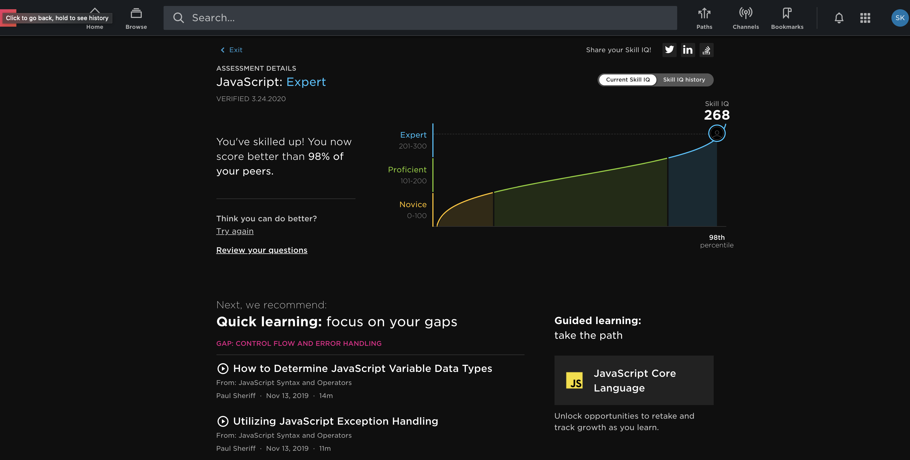

## Deep JavaScript Foundations, v3

|    Date     |    Author    |     Organization    |           Link              |
|:-----------:|:------------:|: ------------------:|:----------------------------|
| 26 May 2021 | Kyle Simpson | frontendmasters.com | https://frontendmasters.com/courses/deep-javascript-v3 |

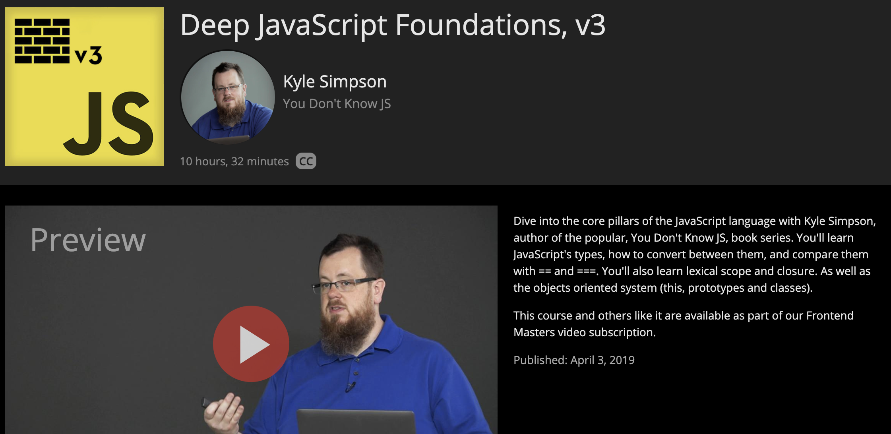

Dive into the **core pillars of the JavaScript** language with Kyle Simpson, author of the popular, You Don't Know JS, book series!

## JavaScript The Hard Parts V2

|    Date   |    Author      |     Organization    |           Link              |
|:---------:|:------------- :|: ------------------:|:----------------------------|
| 16.04.21  | Will Sentence  | frontendmasters.com | https://frontendmasters.com/courses/javascript-hard-parts-v2/ |

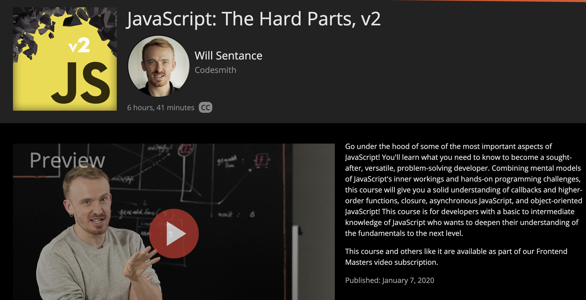

## JavaScript Algorithms and DataStructures Certification

`Topics`: Basic JavaScript, **ES6**, Regular Expression, Debugging, Basic Data Structure, Intermediate Algorithm Scripting, **Object Oriented Programming**, **Functional Programming**, 

|    Date   | Organization      | Link                        |
|:---------:|:-----------------:|:----------------------------|
| 12.08.19  | freecodecamp.com         | https://www.freecodecamp.org/certification/sajibcse68/javascript-algorithms-and-data-structures |

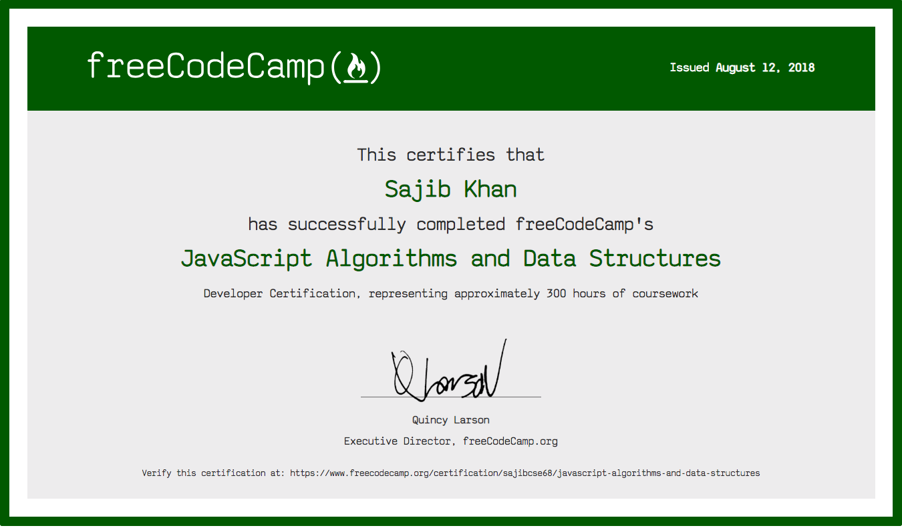

## Front End Libraries

`Topics`: **React**, **Redux**, Bootstrap, jQuery

|    Date   | Organization      | Link                        |
|:---------:|:-----------------:|:----------------------------|
| 20.04.19  | freecodecamp.com         | https://www.freecodecamp.org/certification/sajibcse68/front-end-libraries |

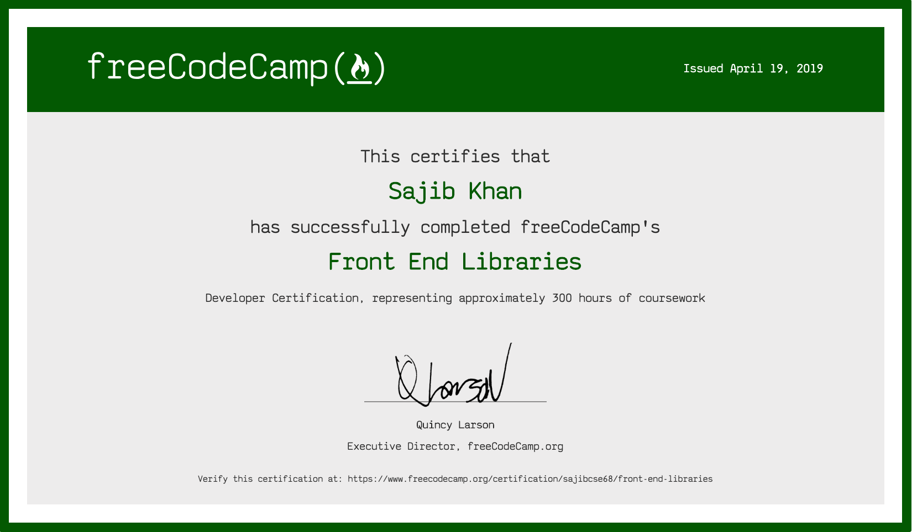

## JavaScript Generators and Iterators

`Topics`: Iterators and Iterables, Generator functions, Cancelable async flows.

|    Date      | Organization      | Link                        |
|:------------:|:-----------------:|:----------------------------|
| 05 Apr 2020  | pluralsight.com   | https://app.pluralsight.com/library/courses/javascript-generators-iterators |

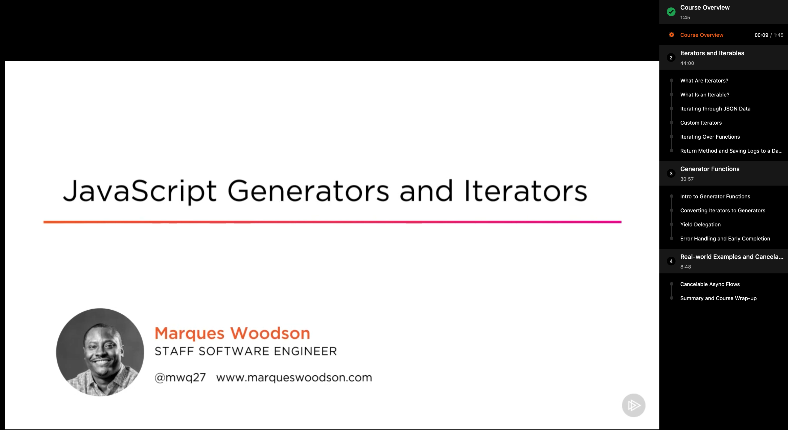

## Working with JavaScript Modules

`Topics`: Various way to export, import or, use javascript modules.

|    Date      | Organization      | Link                        |
|:------------:|:-----------------:|:----------------------------|
| 06 Apr 2020  | pluralsight.com   | https://app.pluralsight.com/library/courses/working-javascript-modules |

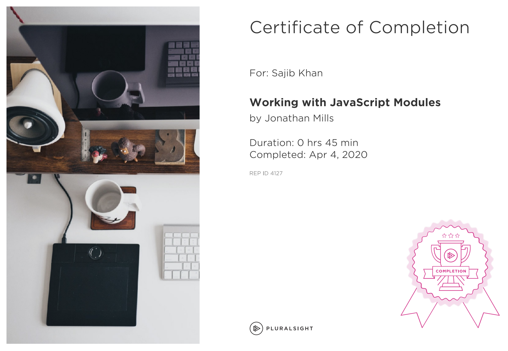

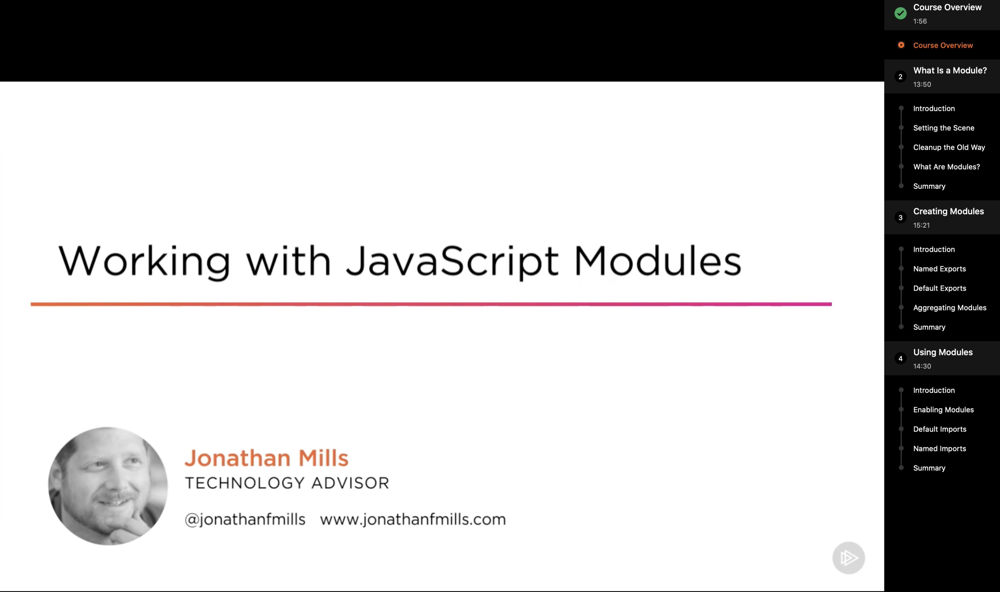

## JavaScript Console Object Ultimate Guide

|    Date     | Organization      | Link                        |
|:---------  :|:-----------------:|:----------------------------|
| 3.02.18     | Udemy.com         | https://www.udemy.com/javascript-console-object-ultimate-guide/ |

## GraphQL Essential Training

|    Date   | Organization      | Link                        |
|:---------:|:-----------------:|:----------------------------|
| 17.07.19  | linkedin.com         | https://www.linkedin.com/learning/graphql-essential-training |

## Webpack 5 Complete Developers Guide

|    Date      | Author        | Organization  | Link                        |
|:------------:|:-------------:|:-------------:|:----------------------------|
| 05 Apr 2021  | Eyas Matter   | udemy.com     | https://www.udemy.com/course/webpack-5-complete-developers-guide-2020/ |

## Webpack 4 Fundamentals

|    Date   | Author        | Organization         | Link                        |
|:---------:|:-------------:|:--------------------:|:----------------------------|
| 20.12.10  | Sean Larkin   | frontendmasters.com  | https://frontendmasters.com/courses/webpack-fundamentals/ |

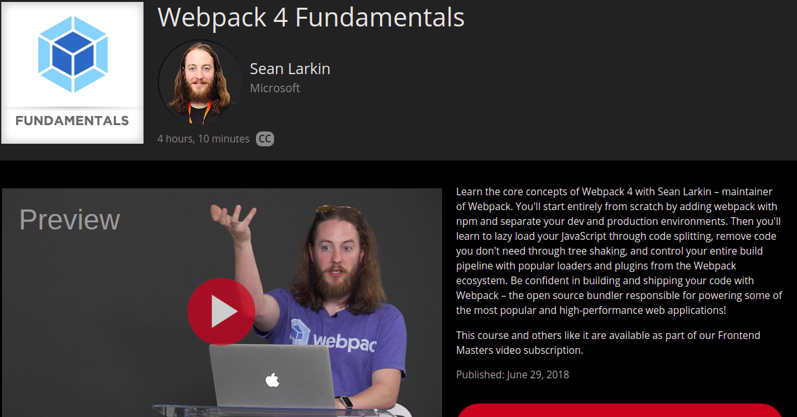

**Description:** Learn the core concepts of Webpack 4 with Sean Larkin – maintainer of Webpack. You'll start entirely from scratch by adding webpack with npm and separate your dev and production environments. Then you'll learn to lazy load your JavaScript through code splitting, remove code you don't need through tree shaking, and control your entire build pipeline with popular loaders and plugins from the Webpack ecosystem. Be confident in building and shipping your code with Webpack – the open source bundler responsible for powering some of the most popular and high-performance web applications!

# Vue.js Courses

## `Vue Advanced` Components Course

|    Date   | Organization      | Link                        |
|:---------:|:-----------------:|:----------------------------|
| 23.02.19  | vuemastery.com         | [https://www.vuemastery.com/courses/advanced-components/the-introduction/](https://www.vuemastery.com/courses/advanced-components/the-introduction/) |

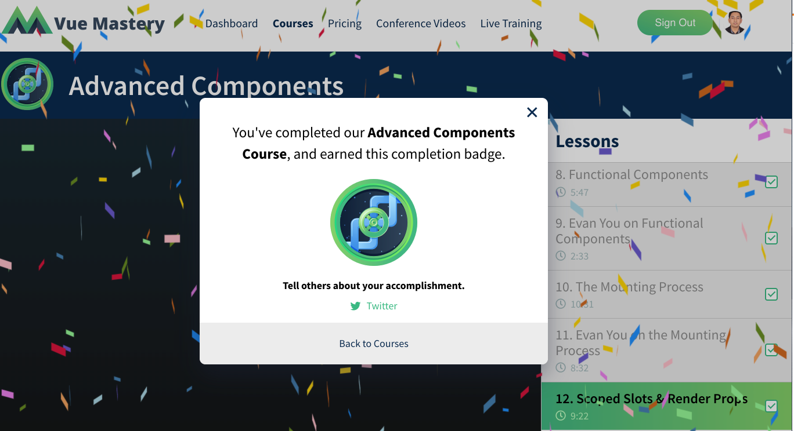

## Scaling Vue with `Nuxt.js`

|    Date   | Organization      | Link                        |
|:---------:|:-----------------:|:----------------------------|
| 14.03.20  | vuemastery.com         | [https://www.vuemastery.com/courses/scaling-vue-with-nuxt-js/why-use-nuxt](https://www.vuemastery.com/courses/scaling-vue-with-nuxt-js/why-use-nuxt) |

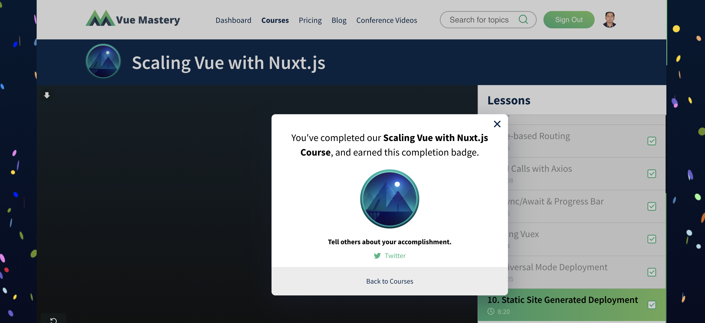

## Mastering in `Vuex` Course

|    Date   | Organization      | Link                        |
|:---------:|:-----------------:|:----------------------------|
| 24.02.19  | vuemastery.com         | [https://www.vuemastery.com/courses/mastering-vuex/intro-to-vuex](https://www.vuemastery.com/courses/mastering-vuex/intro-to-vuex) |

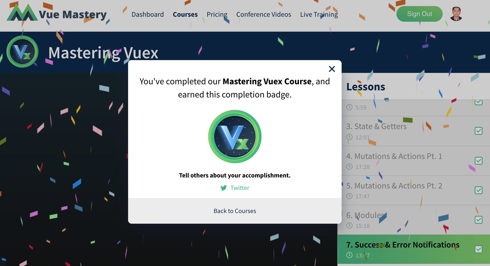

## Real World `Vue.js` Course

|    Date   | Organization      | Link                        |
|:---------:|:-----------------:|:----------------------------|
| 23.02.19  | vuemastery.com         | [https://www.vuemastery.com/courses/real-world-vue-js/real-world-intro](https://www.vuemastery.com/courses/real-world-vue-js/real-world-intro) |

# React and Redux Courses

## Optimize Performance for React

|    Date      | Author            | Organization      | Link                        |
|:------------:|:-----------------:|:-----------------:|:----------------------------|
| 20 Apr 2020  | Hendrik Swanepoel | pluralsight.com   | https://app.pluralsight.com/library/courses/optimize-performance-react/ |

## The Ultimate Redux Course

|    Date      | Organization       | Link                        |
|:------------:|:------------------:|:----------------------------|
| 31 Mar 2021  | codewithmosh.com/  | https://codewithmosh.com/p/ultimate-redux |

**Will Learn**: - What Redux is and when to use it, - Essential functional programming principles, - Use Redux Toolkit to kickstart Redux apps, - Debug apps using Redux DevTools, - Design a Redux store, - Write clean, concise, maintainable Redux code, - Properly structure Redux code, - Handle asynchronous events with redux-thunk, - Use existing middleware or write your own, - Test Redux code, the right way, - Connect React and Redux using react-redux, - The popular tools in Redux ecosystem, - Industry best practices and recommended patterns, - Common mistakes that many Redux devs make

## Modern React with Redux

|    Date   | Organization      | Link                        |
|:---------:|:-----------------:|:----------------------------|
| 30.07.19  | udemy.com         | https://www.udemy.com/react-redux/ |

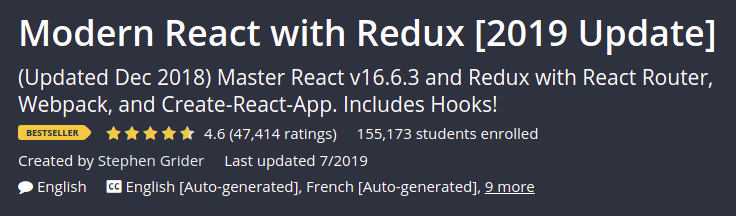

## Styling React Component

`Topics`: UIs in React, Inline Styles, Radium, A Webpack into to CSS, CSS stylesheet, CSS Modules

|    Date      | Organization      | Link                        |
|:------------:|:-----------------:|:----------------------------|
| 02 Apr 2020  | pluralsight.com   | https://www.pluralsight.com/courses/react-styling-components |

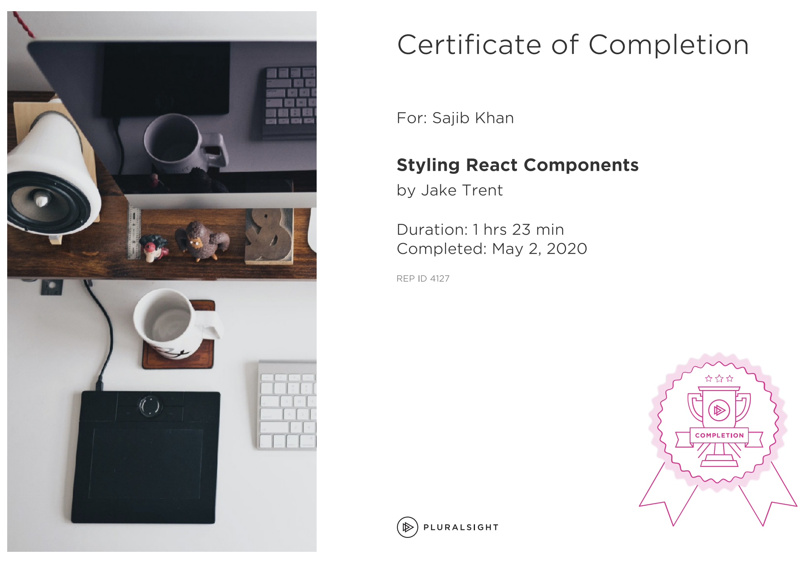

## Redux Saga

|    Date   | Author        | Organization      | Link                        |
|:---------:|:-------------:|:-----------------:|:----------------------------|
| 1.12.19   | Daniel Stern  | pluralsight.com   | https://www.pluralsight.com/courses/redux-saga |

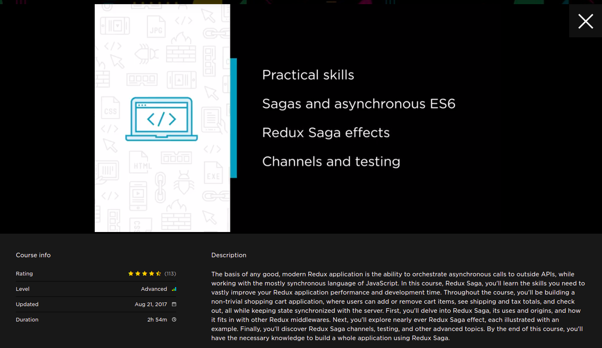

**Description:** The basis of any good, modern Redux application is the ability to orchestrate asynchronous calls to outside APIs, while working with the mostly synchronous language of JavaScript. In this course, Redux Saga, you'll learn the skills you need to vastly improve your Redux application performance and development time. Throughout the course, you'll be building a non-trivial shopping cart application, where users can add or remove cart items, see shipping and tax totals, and check out, all while keeping state synchronized with the server. First, you'll delve into Redux Saga, its uses and origins, and how it fits in with other Redux middlewares. Next, you'll explore nearly ever Redux Saga effect, each illustrated with an example. Finally, you'll discover Redux Saga channels, testing, and other advanced topics. By the end of this course, you'll have the necessary knowledge to build a whole application using Redux Saga.

## React: Components, Context and Accessibility

|    Date   | Organization      | Link                        |
|:---------:|:-----------------:|:----------------------------|
| 18.06.19  | linkedin.com         | https://www.linkedin.com/learning/react-components-context-and-accessibility |

## React Vs Angular Vs Vue JS

|    Date   | Organization      | Link                        |
|:---------:|:-----------------:|:----------------------------|
| 13.02.18  | Udemy.com         | https://www.udemy.com/react-vs-angular-vs-vuejs-by-example/ |

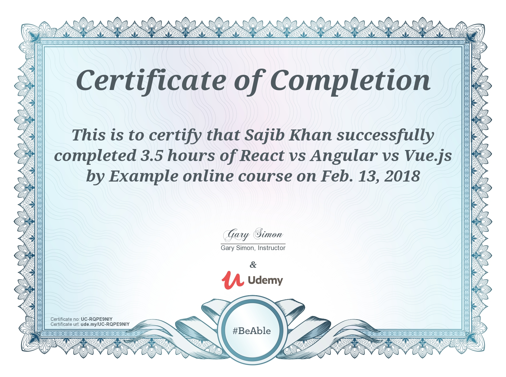

## React Basics

|    Date   | Organization      | Link                        |
|:---------:|:-----------------:|:----------------------------|
| 11.08.18  | Udemy.com         | https://www.udemy.com/react-basic-in-just-1-hour/learn/v4/overview |

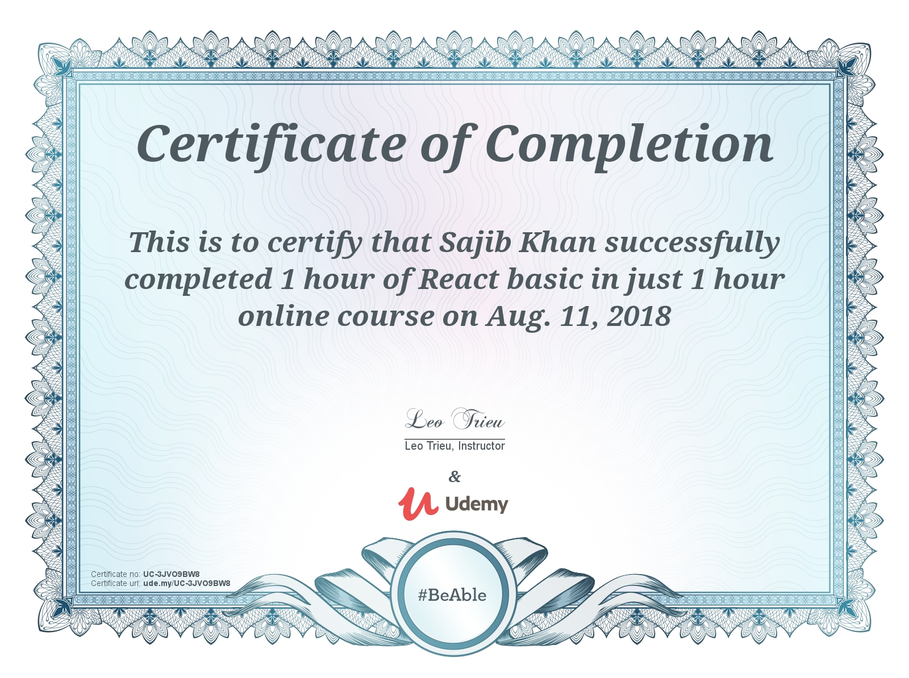

## React Fundamentals

|    Date   | Organization      | Link                        |
|:---------:|:-----------------:|:----------------------------|
| 27.08.18  | Udemy.com         | https://www.udemy.com/react-fundamentals/learn/v4/overview |

# Typescript Courses

## Configuring, Compiling, and Debugging TypeScript Projects

|    Date      | Author       | Organization      | Link                        |
|:------------:|:------------:|:-----------------:|:----------------------------|
| 15 Oct 2021  | Daniel Stern | pluralsight.com   | https://app.pluralsight.com/library/courses/typescript-configuring-compiling-debugging-projects/table-of-contents |

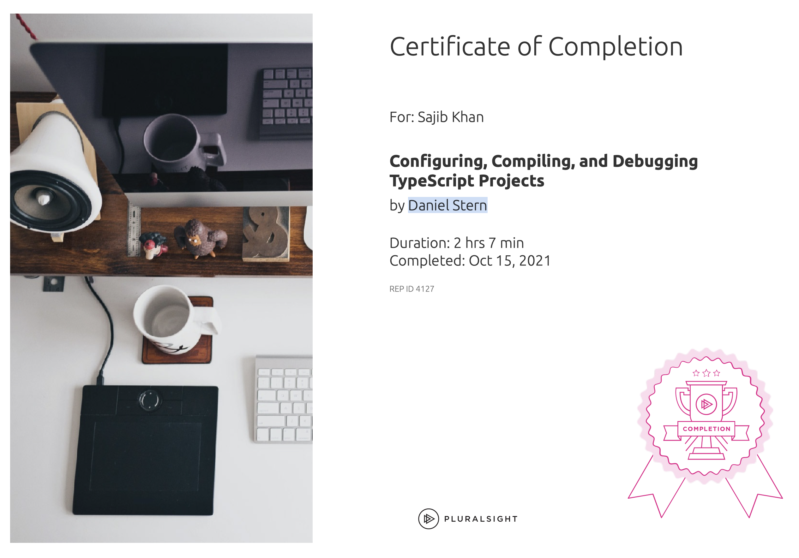

# Node.js Courses

## Node.js Debugging and Performance Tuning

`Topics`: Build a troubleshooting mindset, Introducing microservices, Efective logging strategies, Debugging nodejs applications, Measuring performance.

|    Date      | Author    | Organization    | Link                        |
|:------------:|:---------:|:---------------:|:----------------------------|
| 23 May 2020  | Jon Peck  | linkedin.com | https://www.linkedin.com/learning/node-js-debugging-and-performance-tuning |

## Node.js Getting Started

`Topics`: Modern JavaScript, NPM, NPX, Module & concurrency, Event loop, Errors vs exceptions, Event emitters, Working with web server, working with operating system, Child process.

|    Date      | Author      | Organization    | Link                        |
|:------------:|:-----------:|:---------------:|:----------------------------|
| 19 Apr 2020  | Samer Buna  | pluralsight.com | https://app.pluralsight.com/library/courses/nodejs-getting-started |

# Data Visualization

## Data Visualization using D3.js

Data is all around us, but it doesn't mean much without shape or context. In the Data Visualization Certification, I've built `charts, graphs, and maps to present different types of data` with the D3.js library.

I've also learnt about JSON and how to work with data online using an API.

|    Date      |    Author     | Organization      | Link                        |
|:------------:|:-------------:|:-----------------:|:----------------------------|
| 28 Jun 2020  | freecodecamp  | freecodecamp.com   | https://www.freecodecamp.org/certification/sajibcse68/data-visualization |

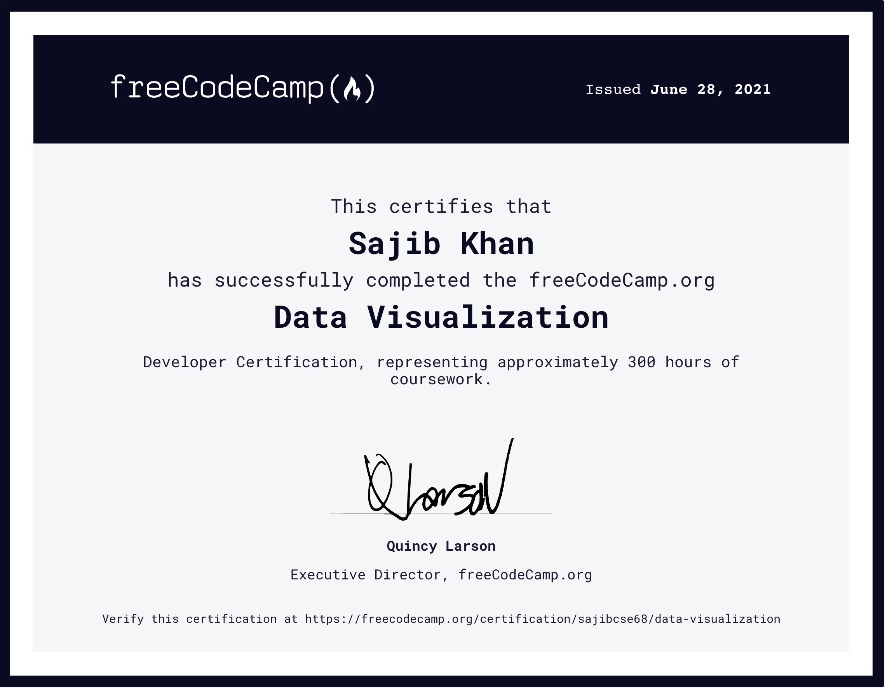

## Data Visualization for React Developers

**Topics:** ● The Basic Chart Types ● Introduction to SVG ● Data to SVG Shapes ● Line ● Radial ● Rendering with React ● Axes, Legends, Annotations ● Transitions ● Brush ● Canvas

|    Date      |    Author   | Organization      | Link                        |
|:------------:|:-----------:|:-----------------:|:----------------------------|
| 06 Apr 2020  | Shirley Wu  | frontendmasters   | https://frontendmasters.com/courses/d3-js-react/ |

## Data Visualization Best Practices

**Topics:** ● Bar chart ● Line chart ● Scatter plots ● Waffle chart ● Pie chart ● Simple text ● Text tables ● Pre-attentive attributes

|    Date      | Organization      | Link                        |
|:------------:|:-----------------:|:----------------------------|
| 12 Apr 2020  | Pluralsight   | https://app.pluralsight.com/library/courses/data-visualization-best-practices |

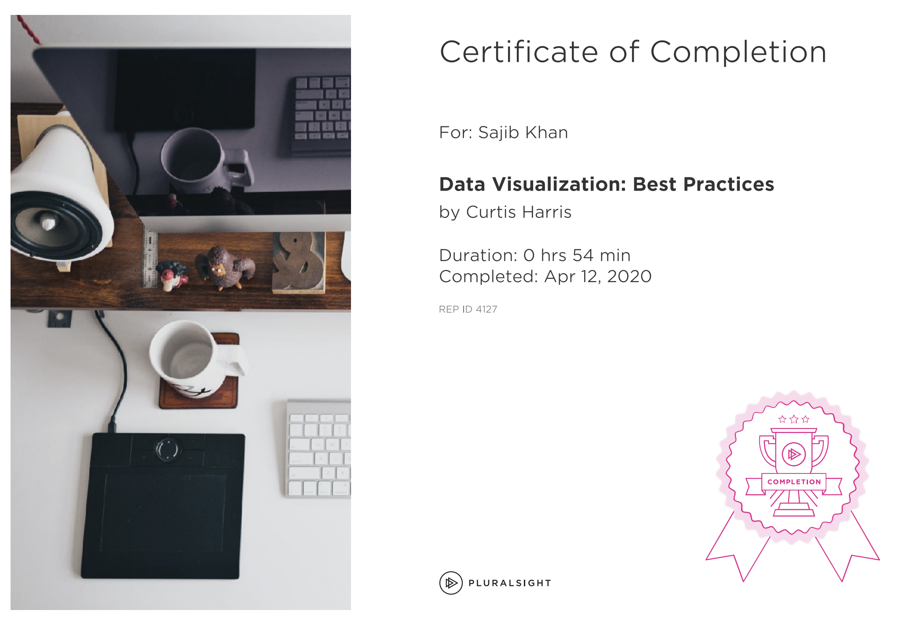

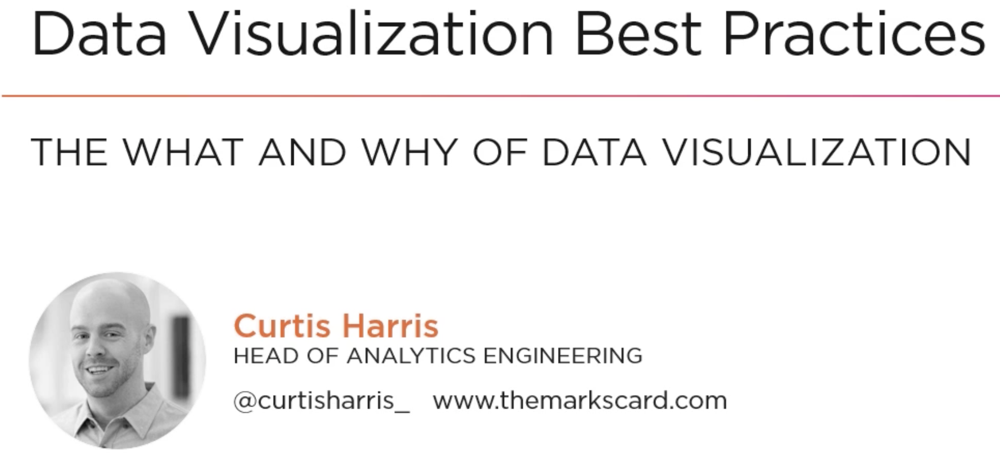

# HTML & CSS

## Advanced Responsive Layouts with CSS Flexbox

|    Date   | Organization      | Link                        |
|:---------:|:-----------------:|:----------------------------|
| 09.11.19  | Lynda.com         | https://www.lynda.com/CSS-tutorials/Advanced-Responsive-Layouts-CSS-Flexbox/383780-2.html |

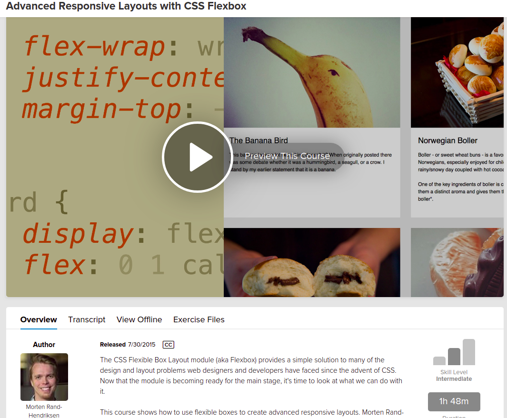

**Topics:** ● Flexbox powered menu ● Responsive card layout ● The holy grail layout ● Animating content 

## The Ultimate HTML Developer

|    Date   | Organization      | Link                        |
|:---------:|:-----------------:|:----------------------------|
| 22.11.18  | udemy.com         | https://www.udemy.com/the-ultimate-html-developer |

# Git

## Git in Depth

|    Date   | Organization      | Link                        |
|:---------:|:-----------------:|:----------------------------|
| 07.10.18  | frontendmasters.com         | https://frontendmasters.com/courses/git-in-depth/ |

## Git Real

|    Date   | Organization      | Link                        |
|:---------:|:-----------------:|:----------------------------|
| -.-.15  | CodeSchool.com         | https://www.pluralsight.com/courses/code-school-git-real |

# Miscellaneous

## Get Involved

|    Date      | Organization      | Link                        |
|:------------:|:-----------------:|:----------------------------|
| 11 Apr 2020  | pluralsight.com   | https://app.pluralsight.com/library/courses/get-involved |

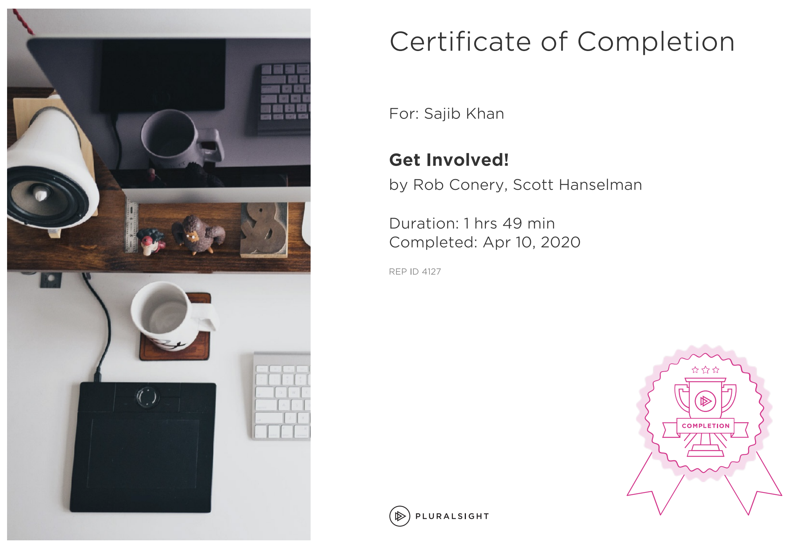

## The Complete Google Go Programming Course

|    Date   | Organization      | Link                        |
|:---------:|:-----------------:|:----------------------------|
| 09.07.18  | Udemy.com         | https://www.udemy.com/googlego/learn/v4/overview |

## Google Analytics: Basic Principles

|    Date   | Organization      | Link                        |
|:---------:|:-----------------:|:----------------------------|
| 16.07.18  | Udemy.com         | https://www.udemy.com/google-analytics-basic-principles/learn/v4/overview |

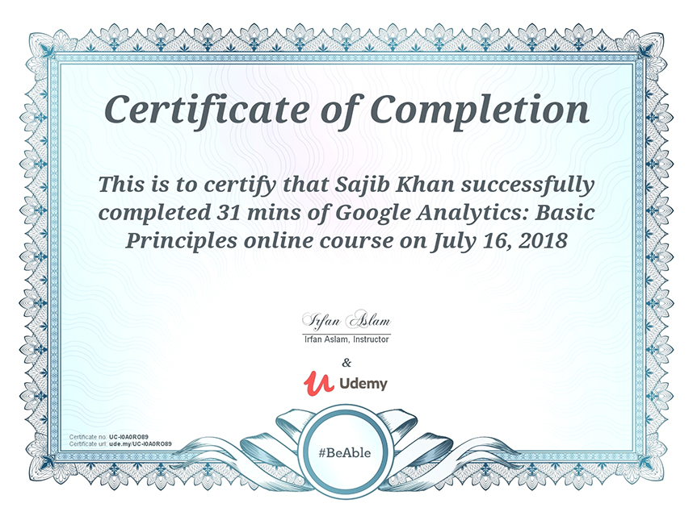

## Time Management for Professionals

|    Date      | Organization      | Link                        |
|:------------:|:-----------------:|:----------------------------|
| 03 Mar 2021  | Udemy.com         | https://www.udemy.com/course/time-management-for-professionals |

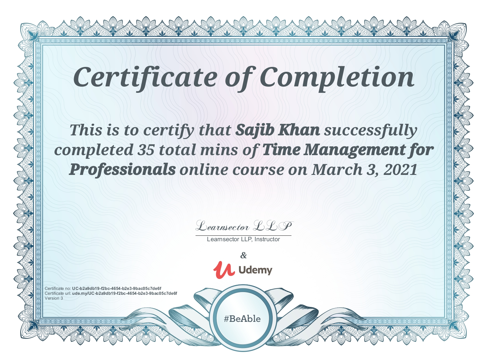

## Productivity Hacks: Easy, Quick & Effective

|    Date   | Organization      | Link                        |
|:---------:|:-----------------:|:----------------------------|
| 25.07.18  | Udemy.com         | https://www.udemy.com/productivityhacks/learn/v4/overview |

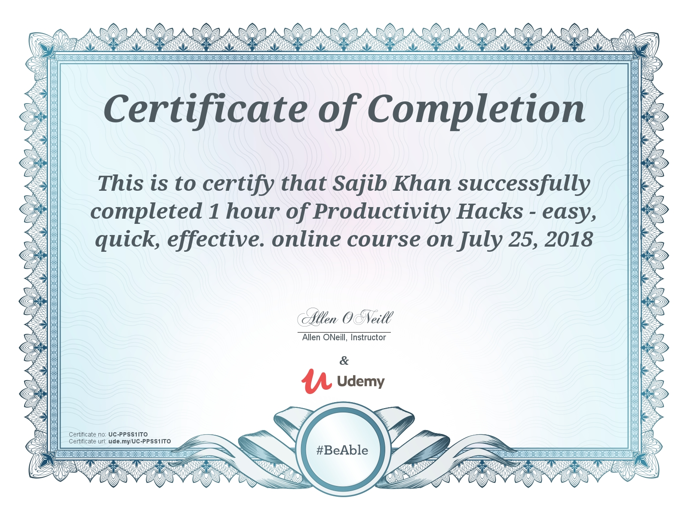

## Mastering Personal Education: Personal Education for Success

|    Date   | Organization      | Link                        |
|:---------:|:-----------------:|:----------------------------|
| 26.09.18  | Udemy.com         | https://www.udemy.com/mastering-personal-education-personal-education-for-success |

## The Best Hacks To Improve Yourself

|    Date   | Organization      | Link                        |
|:---------:|:-----------------:|:----------------------------|
| 25.11.18  | Udemy.com         | https://www.udemy.com/personal-improvement-the-best-hacks-to-improve-yourself |

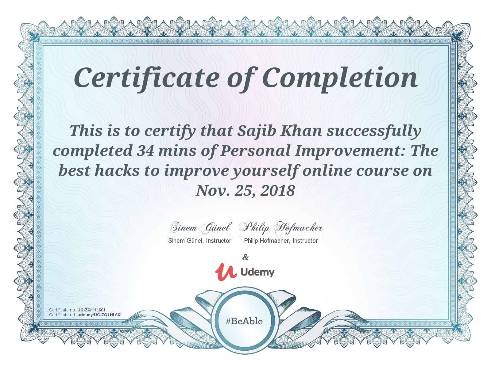

## Understanding Domain Name System (DNS)

|    Date   | Organization      | Link                        |
|:---------:|:-----------------:|:----------------------------|
| 6.01.19  | Udemy.com         | https://www.udemy.com/dnsguide/learn/v4/overview |

## Google Spreadsheet Basics

|    Date   | Organization      | Link                        |
|:---------:|:-----------------:|:----------------------------|
| 6.01.19  | Udemy.com         | https://www.udemy.com/dnsguide/learn/v4/overview |

